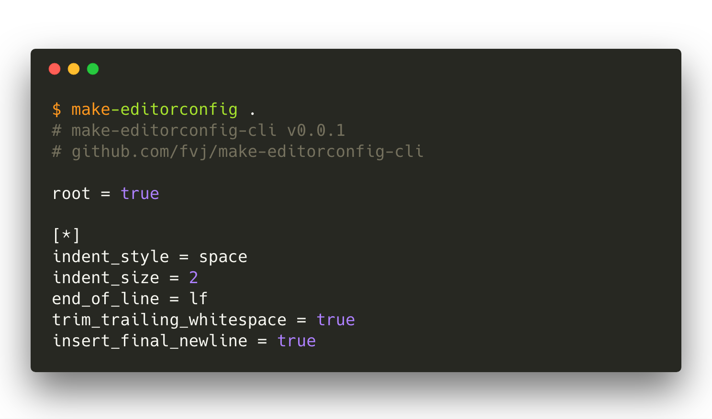

# make-editorconfig-cli

[](https://github.com/RichardLitt/standard-readme)
TODO: Put more badges here.

> A CLI to generate an editorconfig given a directory.

Uses [make-editorconfig](https://github.com/fvj/make-editorconfig) to produce
an editorconfig given a directory.

## Table of Contents

- [Background](#background)
- [Install](#install)
- [Usage](#usage)
- [Maintainers](#maintainers)
- [Contribute](#contribute)
- [License](#license)

## Background

## Install

* Using [yarn](https://yarnpkg.com): `yarn add make-editorconfig-cli`
* Using [npm](https://npmjs.com/get-npm): `npm install --save make-editorconfig-cli`


## Usage

```
  make-editorconfig [options] <directory>


  Options:

    -V, --version                    output the version number
    -i, --ignore <glob>,[<glob>...]  Ignore glob(s) (default: )
    -d, --debug                      print debug output
    -o, --output <file>              Redirect output
    -h, --help                       output usage information
```

Using [facebook/react](https://github.com/facebook/react) as an example:

  

## Maintainers

[@fvj](https://github.com/fvj)

## Contribute

PRs accepted.

Small note: If editing the README, please conform to the [standard-readme](https://github.com/RichardLitt/standard-readme) specification.

## License

MIT © 2018 Julius von Froreich
